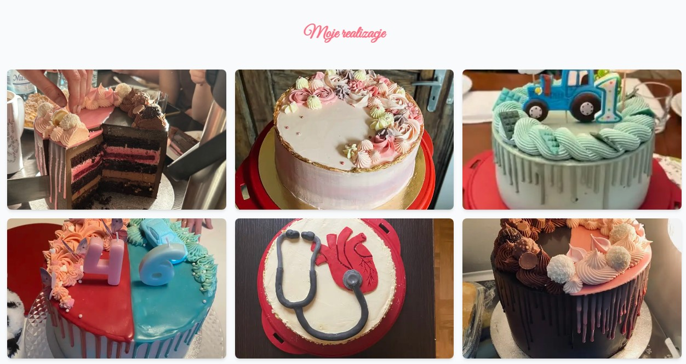

# Sweet Creations
[Zobacz stronę na żywo](https://hanuskowytorcik.vercel.app)

## Technologia
- [Next.js](https://nextjs.org)

## Screeny ze strony
### Nowy brązowy styl

### Stary zielony styl

### Stary różowy styl styl

## Kontakt
Jeśli chcesz się skontaktować, napisz na: [rafal.wizen@gmail.com](mailto:rafal.wizen@gmail.com)

## Licencja
Projekt jest udostępniany na licencji MIT. Licencja nie dotyczy zdjęć zawartych w projekcie.